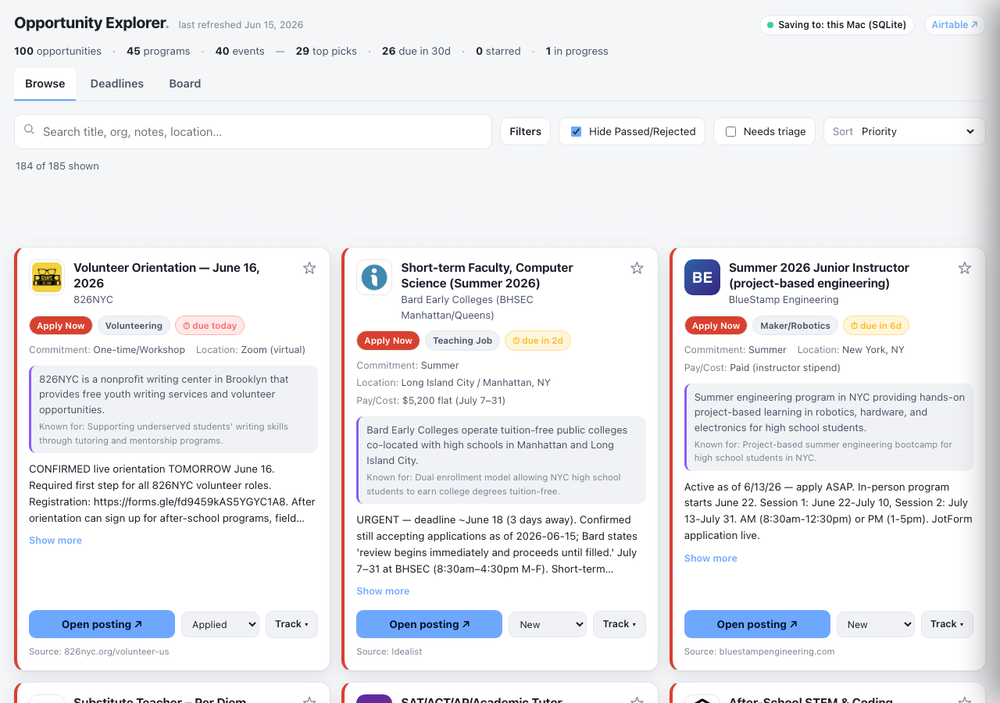
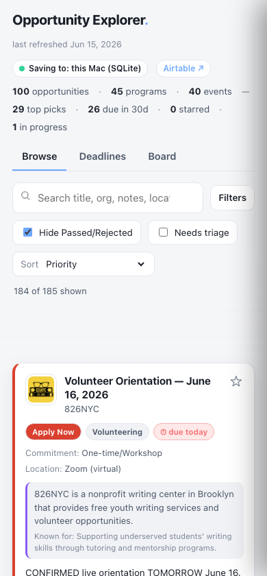
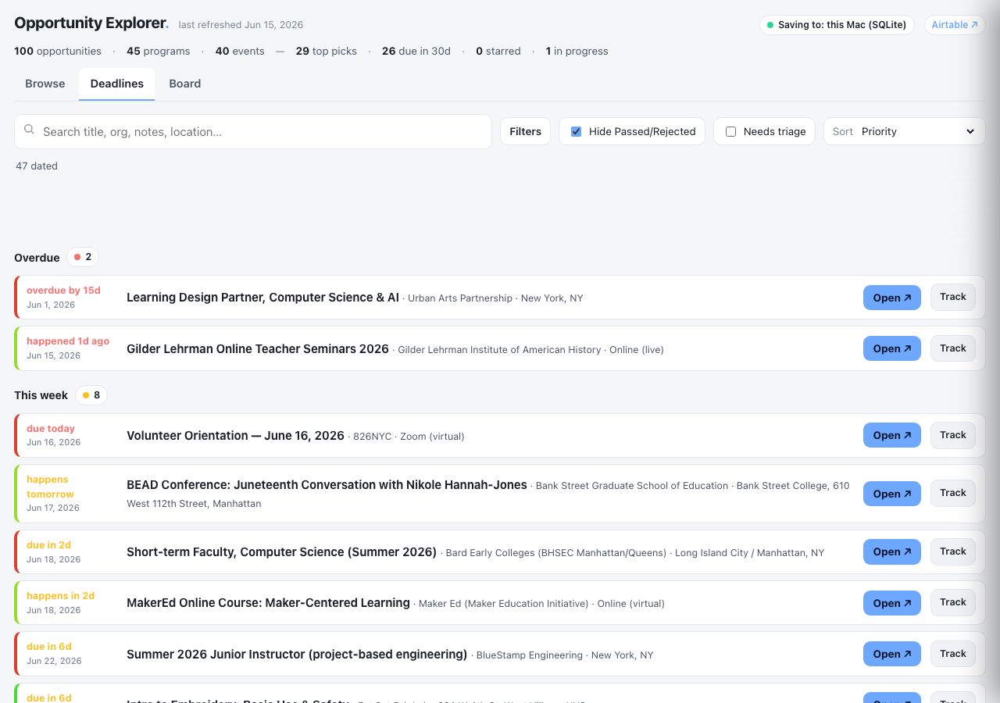
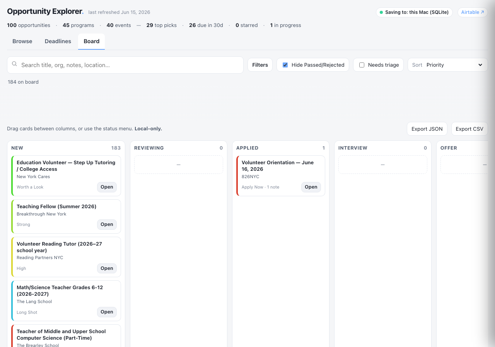
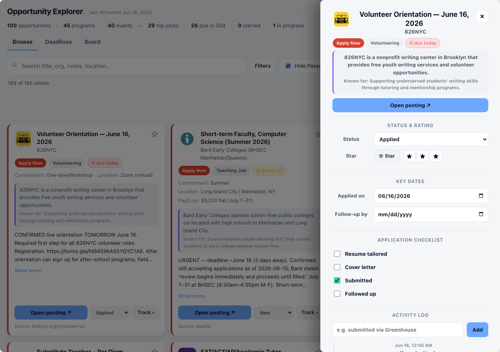

# Verification report

Generated: 2026-06-16T04:05:58.980Z

**27 PASS · 0 FAIL · 0 BLOCKED** of 27 checks.

| Result | Check | Note |
|---|---|---|
| ✅ PASS | default Browse shows all non-terminal items (184) | 184/184 |
| ✅ PASS | all items render (card count == total) | 185/185 |
| ✅ PASS | zero console errors |  |
| ✅ PASS | no third-party network requests |  |
| ✅ PASS | header shows per-dataset counts (100/45/40) | 100 opportunities · 45 programs · 40 events — 29 top picks · 26 due in 30d · 0 starred · 0 in progress |
| ✅ PASS | storage badge shows SQLite when served | Saving to: this Mac (SQLite) |
| ✅ PASS | every card has a logo or monogram | 0 missing |
| ✅ PASS | cards have target=_blank rel=noopener external links | 183 links |
| ✅ PASS | about/known-for line shown when enrichment present | 184 cards |
| ✅ PASS | dataset chip labeled "Opportunities" not "Jobs" | Opportunities
100,Programs
45,Events
40 |
| ✅ PASS | dataset filter (events) narrows to 40 | 40 |
| ✅ PASS | combined filters AND together (events + Go) | 8 |
| ✅ PASS | clear filters restores all |  |
| ✅ PASS | search narrows results | 48 |
| ✅ PASS | clearing search restores all |  |
| ✅ PASS | Hide Passed/Rejected is ON by default |  |
| ✅ PASS | Needs triage filter works | 184 New |
| ✅ PASS | changing sort reorders cards | prio:"Volunteer Orientatio" org:"Volunteer Writing Tu" |
| ✅ PASS | starred item floats to top | top=rec9WwOycDzNRGUBG |
| ✅ PASS | SQLite: status+log+date+checklist persist across reload | {"s":"Applied","a":"2026-06-16","c":{"Submitted":true},"logs":1} |
| ✅ PASS | progress survives matched by id (separate app.db) | app.db is independent of data.js |
| ✅ PASS | Board renders full pipeline columns even when empty | NEW,REVIEWING,APPLIED,INTERVIEW,OFFER,ACCEPTED,REJECTED,PASSED |
| ✅ PASS | Deadlines groups by urgency + calm No date tail | Overdue,This week,Next 30 days,Later |
| ✅ PASS | Export CSV + JSON work |  |
| ✅ PASS | no horizontal overflow at 390px | overflow=1px |
| ✅ PASS | file:// fallback renders cards | 184/184 |
| ✅ PASS | file:// uses localStorage (browser-only badge) | Saving to: this browser only |

## Screenshots

### browse-1280.png

### browse-390.png

### deadlines-1280.png

### board-1280.png

### drawer-1280.png

